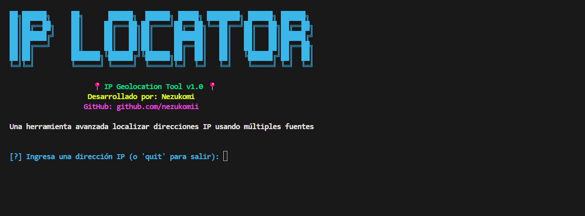

# IP Locator | By  Nezukomi 🙀


[](https://whatsapp.com/channel/0029VarSMCuL2AU2EUONKu08)

Esta es una herramienta la cual sirve para localizar IPs poniendola, actualmente no se puede obtener una ubicacion realmente
exacta, pero quisas trayendo mas actualizaciones se hara disponible la localizacion exactacta, mientras tanto puedes usar esta herramienta para diferentes cosas las cuales son Rastreo de IPs y Generar un link temporal para rastrear la IPs, tambien este no tiene aun la capacidad de bloquear los VPN, por ahora.


---

## Instalacion de IP Locator

### Primero, clona el repositorio
```bash
git clone https://github.com/nezukomii/ip-geolocation-tool.git
cd ip-geolocation-tool
```

### Instala las librerias necesarias
```bash
pip install -r requirements.txt
```

### Si usas Linux o Mac, hazlo ejecutable
```bash
chmod +x main.py
```
---

## Como Activarlo

Solamente tienes que estar en la carpeta que sese clono poniendo ```cd ip-geolocation-tool``` y luego poner este comando:

```bash
python main.py
```
---

## informacion de comandos

Aquí tienes todas las formas en que puedes usar esta herramienta:

```
-i, --ip       La IP que quieres investigar
-f, --file     Tu archivo con muchas IPs para procesar
-o, --output   Guarda los resultados en un archivo JSON
-h, --help     Si te pierdes, aquí está la ayuda
```

Ejemplo de uso: ```python main.py -i 9.9.9.9.9```

---

[](https://www.tiktok.com/@nezukomii)  
[](https://ko-fi.com/nezukomii)  
[](https://www.youtube.com/@nezukomii)

[](https://www.patreon.com/@nezukomii)

> Developed By Nezukomi | [Soblend Team](https://whatsapp.com/channel/0029VarSMCuL2AU2EUONKu08)
